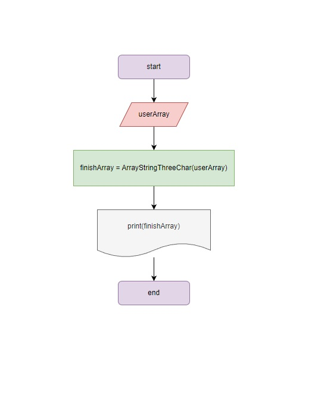
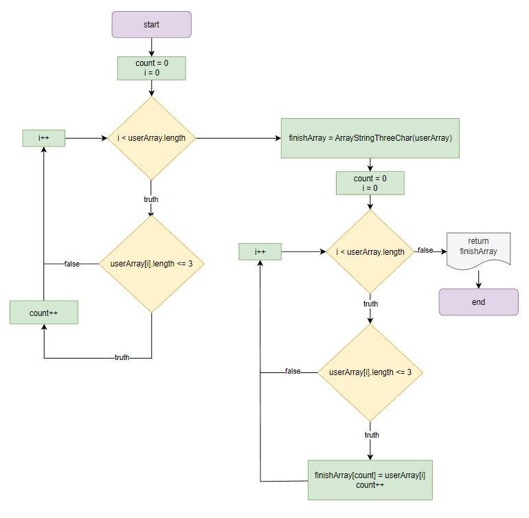

# Итоговая проверочная работа (I четверть)
## Задача
    Написать программу, которая из имеющегося массива строк формирует массив из строк,
    длина которых меньше, либо равна 3 символа. Первоначальный массив можно ввести с клавиатуры, 
    либо задать на старте выполнения алгоритма. 
    При решении не рекомендуется пользоваться коллекциями, лучше обойтись исключительно массивами.
### Примеры:
    ["hello", "2", "world", ":-)"] -> ["2", ":-)"]
    ["1234", "1567", "-2", "computer science"] -> ["-2"]
    ["Russia", "Denmark", "Kazan"] -> []

## Для решения данной проверочной работы, необходимо выполнить следующие действия:
1. Создать репозиторий на GitHub;
2. Нарисовать блок-схему алгоритма;
3. Снабдить репозиторий оформленным текстовым описанием решения;
4. Написать программу, решающую поставленную задачу;
5. Использовать контроль версий в работе над этим небольшим проектом.

## Решение
### Шаг 1
Создаю удаленный репозиторий на [GitHub](https://github.com/Ponikarovskiy/GB_FinalProject_01.git)
### Шаг 2
Составляю блок-схему алгоритма основной части программы, которая из имеющегося массива строк формирует массив из строк, длина которых меньше или равна 3-м символам.

### Шаг 3
Составляю блок-схему алгоритма создания метода, в котором будет получен массив из строк, длина которого будет меньше, либо равна 3-м символам.

### Шаг 4
Данный файл [README.md](https://github.com/Ponikarovskiy/GB_FinalProject_01/blob/main/README.md), который Вы сейчас читаете, является текстовым описанием решения проверочной работы.
